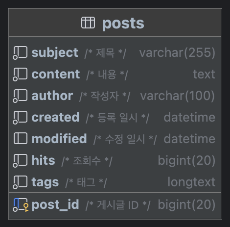

# 토이 프로젝트 - 게시판

점진적으로 발전해나가는 게시판 프로젝트

### Spring 3

파일 업로드를 구현했다.


```mariadb
create table files
(
    file_id   bigint       not null auto_increment comment '파일 ID',
    file_name varchar(255) not null comment '파일명',
    file_size int          not null comment '파일 크기',
    file_type varchar(50)  not null comment '파일 타입',
    file_path varchar(255) not null comment '파일 경로',
    created   datetime     not null comment '등록 일시',
    primary key (file_id)
);

create table post_files
(
    post_id bigint not null comment '게시글 ID',
    file_id bigint not null comment '파일 ID',
    primary key (post_id, file_id)
);

alter table post_files add foreign key (post_id) references posts (post_id) on delete cascade;
alter table post_files add foreign key (file_id) references files (file_id) on delete cascade;
```

### Sprint 2

조회 수와 태그 목록 기능을 개발했다.

조회 수 중복 증가 방지를 위해 레디스를 사용 했다. 업데이트는 비관적 락(`select for update`)을 사용해 업데이트 했다.



```mariadb
/* 조회수 컬럼 추가 */
alter table posts add column hits bigint default 0 not null comment '조회수';
/* 태그 컬럼 추가 */
alter table posts add column tags json default '[]' not null comment '태그' check (json_valid(`tags`));
```

### Sprint 1

간단한 테이블을 생성하고 기본적인 CRUD를 구현했다.

* 프로젝트 생성
* CRUD 구현


```mariadb
create table posts
(
    post_id  bigint       not null auto_increment comment '게시글 ID',
    subject  varchar(255) not null comment '제목',
    content  text         not null comment '내용',
    author   varchar(100) not null comment '작성자',
    created  datetime     not null comment '등록 일시',
    modified datetime     null comment '수정 일시',
    primary key (post_id)
);
```

```mariadb
/* 데이터베이스와 계정 생성 */
create database toy_board;
create user 'antop'@'%' identified by 'local';
grant all privileges on toy_board.* to 'antop'@'localhost';
flush privileges;
```
