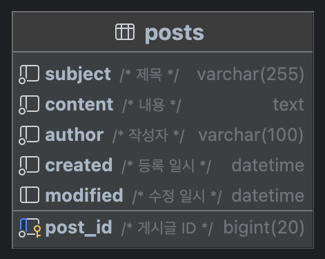

# 토이 프로젝트 - 게시판

[](https://sonarcloud.io/summary/new_code?id=antop-dev_toy-board)
[](https://sonarcloud.io/summary/new_code?id=antop-dev_toy-board)
[](https://sonarcloud.io/summary/new_code?id=antop-dev_toy-board)
[](https://sonarcloud.io/summary/new_code?id=antop-dev_toy-board)
[](https://sonarcloud.io/summary/new_code?id=antop-dev_toy-board)
[](https://sonarcloud.io/summary/new_code?id=antop-dev_toy-board)
[](https://sonarcloud.io/summary/new_code?id=antop-dev_toy-board)
[](https://sonarcloud.io/summary/new_code?id=antop-dev_toy-board)
[](https://sonarcloud.io/summary/new_code?id=antop-dev_toy-board)
[](https://sonarcloud.io/summary/new_code?id=antop-dev_toy-board)
[](https://sonarcloud.io/summary/new_code?id=antop-dev_toy-board)

점진적으로 발전해나가는 게시판 프로젝트

## Sprint 7

### 코멘트 구현

코멘트 수정은 아직 구현 못함 ㅠㅠ

```mysql
create table comments
(
   comment_id bigint   not null auto_increment comment '코멘트ID',
   post_id    bigint   not null comment '게시물ID',
   content    text     not null comment '내용',
   created    datetime not null comment '등록일시',
   modified   datetime null comment '수정일시',
   removed    boolean  not null default false comment '삭제여부',
   primary key (comment_id),
   foreign key (post_id) references posts (post_id)
);

alter table posts add comments int default 0 not null comment '코멘트 수';
```

## Sprint 6

### `local-docker` 프로파일 추가 : 도커의 MariaDB, Redis를 사용.

* `local` : H2(MySQL Mode)와 Embedded Redis를 사용. 서버 재시작하면 데이터 다 날라감 ㅜㅠ
* `local-docker` : 도커(아니어도 됨)에 올린 MariaDB와 Redis를 사용

### SQL 쿼리 로깅

`Exposed`에서 제공하는 로그는 맘에 들지 않아 p6spy + sql-formatter 조합으로 로그 SQL 로그 출력

### 공통 에러 페이지 구성

### 댓글 구현

1. 쓰레드로 댓글값 구현 (1000 단위 : 게시글, 1~999 : 댓글)
   1. 게시글은 최대 `long / 1000`개 등록할 수 있다. 
   2. 댓글은 게시글 하나당  최대 999개를 등록할 수 있다.
2. 등록/수정/댓글 컨트롤러 분리 (+ Thymeleaf)
3. 게시글 소프트 삭제 (삭제된 게시글은 "삭제된 게시글"로 노출)

```mysql
alter table posts add thread bigint not null comment '쓰레드';
alter table posts add depth int not null default 0 comment '들여쓰기';
alter table posts add removed boolean not null default false comment '삭제 여부';
```

## Sprint 5

### 완전한 로컬 환경에서 실행 가능하도록 구성

로컬에서 외부 서버를 사용하지 않고 H2와 Embedded Redis를 사용하여 인터넷이 안되더라도 개발 가능하도록 함 

* 외부 MariaDB → H2 Tcp Database Server
* 외부 Redis → [Embedded Redis Server](https://github.com/codemonstur/embedded-redis)

### Bootstrap UI 구성

부트스트랩을 사용하여 화면을 이쁘게(?) 꾸밈

* [Bootstrap 5](https://getbootstrap.com/)
* [Bootstrap Icons](https://icons.getbootstrap.com/)
* [Tags for Bootstrap 4/5](https://github.com/lekoala/bootstrap5-tags)
* 나눔고딕 웹폰트

### 위지윅에디터 적용

* [CKEditor5](https://ckeditor.com/ckeditor-5/)
* [Prism](https://prismjs.com/) : 코드 블럭 하이라이트

### 태그 목록 재구성

```mysql
alter table posts modify column tags text null comment '태그';
```

## Sprint 4

파일 업로드를 구현했다.


```mysql
create table files
(
    file_id   bigint       not null auto_increment comment '파일 ID',
    file_name varchar(255) not null comment '파일명',
    file_size int          not null comment '파일 크기',
    file_type varchar(50)  not null comment '파일 타입',
    file_path varchar(255) not null comment '파일 경로',
    created   datetime     not null comment '등록 일시',
    primary key (file_id)
);

create table post_files
(
    post_id bigint not null comment '게시글 ID',
    file_id bigint not null comment '파일 ID',
    primary key (post_id, file_id)
);

alter table post_files add foreign key (post_id) references posts (post_id) on delete cascade;
alter table post_files add foreign key (file_id) references files (file_id) on delete cascade;
```

## Sprint 3

조회 수와 태그 목록 기능을 개발했다.

조회 수 중복 증가 방지를 위해 레디스를 사용 했다. 업데이트는 비관적 락(`select for update`)을 사용해 업데이트 했다.


```mysql
/* 조회수 컬럼 추가 */
alter table posts add column hits bigint default 0 not null comment '조회수';
/* 태그 컬럼 추가 */
alter table posts add column tags json default '[]' not null comment '태그' check (json_valid(`tags`));
```

## Sprint 2

오프셋(`offset`) 방식의 페이징과 검색 기능을 개발했다.

## Sprint 1

간단한 테이블을 생성하고 기본적인 CRUD를 구현했다.

* 프로젝트 생성
* CRUD 구현



```mysql
create table posts
(
    post_id  bigint       not null auto_increment comment '게시글 ID',
    subject  varchar(255) not null comment '제목',
    content  text         not null comment '내용',
    author   varchar(100) not null comment '작성자',
    created  datetime     not null comment '등록 일시',
    modified datetime     null comment '수정 일시',
    primary key (post_id)
);
```

```mysql
/* 데이터베이스와 계정 생성 */
create database toy_board;
create user 'antop'@'%' identified by 'local';
grant all privileges on toy_board.* to 'antop'@'localhost';
flush privileges;
```
